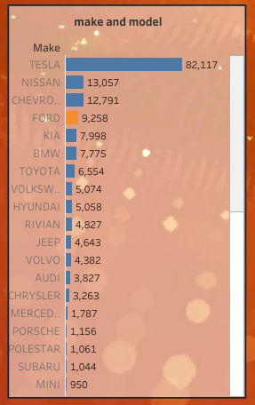
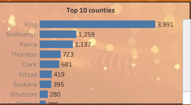
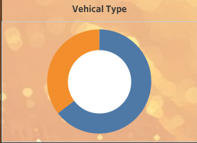
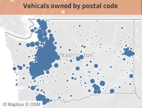
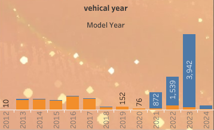

# Electric Vehicle Analysis Project

## Project Overview

This project analyzes electric vehicle (EV) data to explore trends, insights, and implications for the adoption of electric vehicles across different counties  in Washington,United States. The dataset encompasses various attributes related to electric vehicles, including their specifications, registration details, and eligibility for clean fuel programs.

## Objectives

The main objectives of this project are:

1. **Trend Analysis**: Investigate the trends in electric vehicle registrations over the years.
2. **Geographical Insights**: Analyze how electric vehicle adoption varies by region, including urban vs. rural comparisons.
3. **Pricing Analysis**: Examine the relationship between electric range and base MSRP across different makes and models.
4. **Policy Recommendations**: Provide insights that can inform policy-making related to sustainable transportation initiatives.

## Tools and Technologies

### Tools and Techniques

This analysis is carried out using the following tools:
- **Tableau**: For data manipulation, analysis, and visualization.

## Dataset Description

The dataset contains the following fields:

- **VIN (1-10)**: Vehicle Identification Number (VIN) of the vehicle.
- **County**: The county where the vehicle is registered.
- **City**: The city of registration.
- **State**: The state of registration.
- **Postal Code**: The postal code for the registered location.
- **Model Year**: The year the vehicle model was manufactured.
- **Make**: The manufacturer of the vehicle (e.g., Tesla, Nissan).
- **Model**: The specific model of the vehicle.
- **Electric Vehicle Type**: Category of the electric vehicle (e.g., battery electric, plug-in hybrid).
- **Clean Alternative Fuel Vehicle (CAFV) Eligibility**: Eligibility status for clean fuel vehicle programs.
- **Electric Range**: Maximum range on a full charge (in miles).
- **Base MSRP**: Manufacturer's suggested retail price for the vehicle.
- **Legislative District**: Legislative district of registration.
- **DOL Vehicle ID**: Department of Licensing Vehicle ID.
- **Vehicle Location**: Geographical location of the vehicle.
- **Electric Utility**: Utility company servicing the location.
- **2020 Census Tract**: Census tract of registration.

### Data Format

The dataset is provided in [CSV] format (specify the format), making it easy to access and analyze using various tools.

## Insights

### Insight 1: Total Number of Vehicles Registered by Make

- **Description**: This insight analyzes the total number of vehicles registered under each make.
- **Visualization**: 

The chart shows that Tesla electric cars has the maximum distribution over Washington DC 

### Insight 2: Top 10 Counties with Maximum Vehicles Owned

- **Description**: This section highlights the top 10 counties that own the maximum number of electric vehicles.
- **Visualization**: 

It is enlightened that most of the electric cars are owned by king county in Washington and the number of cars made will be affected by the car make filter 

### Insight 3: Distribution of Electric Vehicles by Type

- **Description**: A donut chart representing the distribution count between battery electric vehicles and plug-in electric vehicles.
- **Visualization**: 

For each car make selected from the filter the values of the donut chart changes
Some insights from the analysis are there is no  distribution of plug-in vehicals in jaguar cars in Washington and about the popular car likes Audi,Ford,kia  people prefer to buy battery vehicals than plug in vehicals  whereas for BMW plugin vehicals are bought more than battery vehicals

### Insight 4: Electric Vehicles Owned by Postal Codes

- **Description**: This map chart displays the distribution of electric vehicles owned by  each postal code in Wasgington  with respect to each car make 
- **Visualization**: 

### Insight 5: Number of Electric Vehicles by Model Year

- **Description**: A bar chart representing the number of battery electric vehicles and plug-in electric vehicles made in each model year.
The major insight from this analysis is the distribution of  cars are maximum in the year 2024 ,people have bought a large number of cars in 2024

- **Visualization**: 

### Project Files

- **Electriv vehicle  Dataset**: [Link to  electricvehical Data] (https://github.com/NandhiniKumar12/ElectricVehicle-distribution-Analysis/blob/main/Electric_Vehicle_Population_Data.zip)
- **Tableau Dashboard **: [Link to  electricvehical Data]( https://github.com/NandhiniKumar12/ElectricVehicle-distribution-Analysis/blob/main/EV%20Analysis.twbx)
